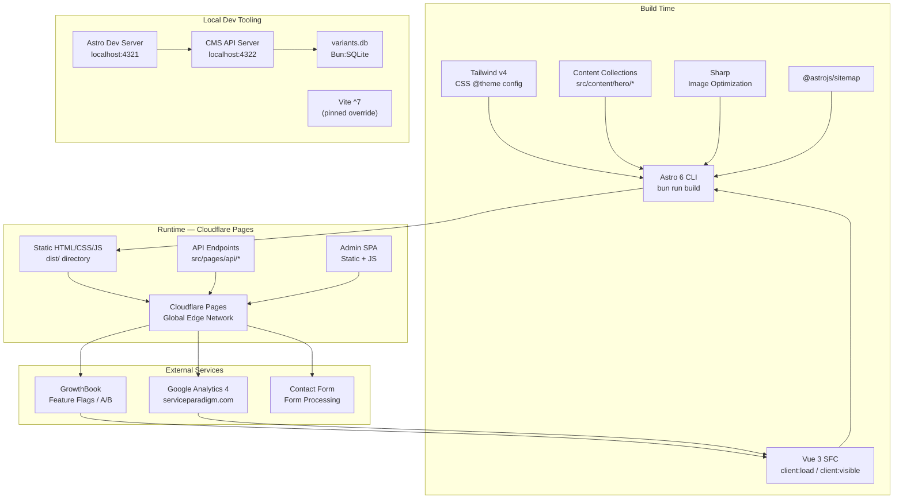
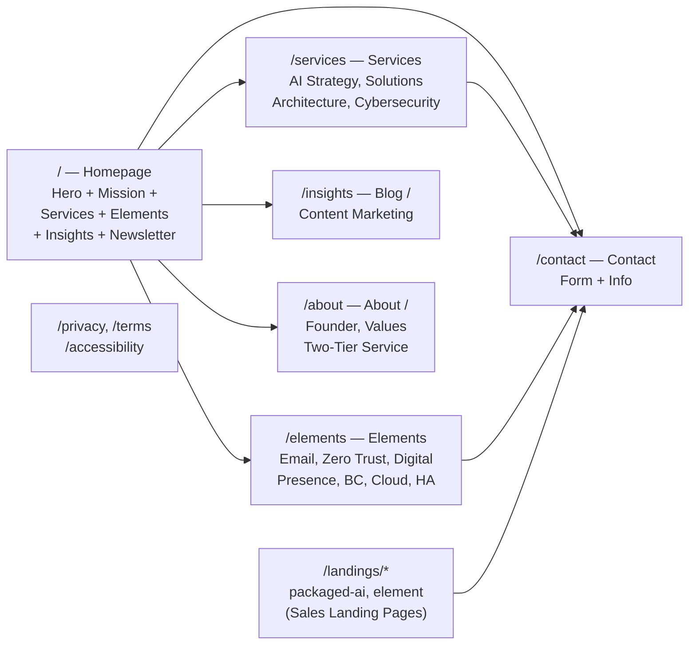
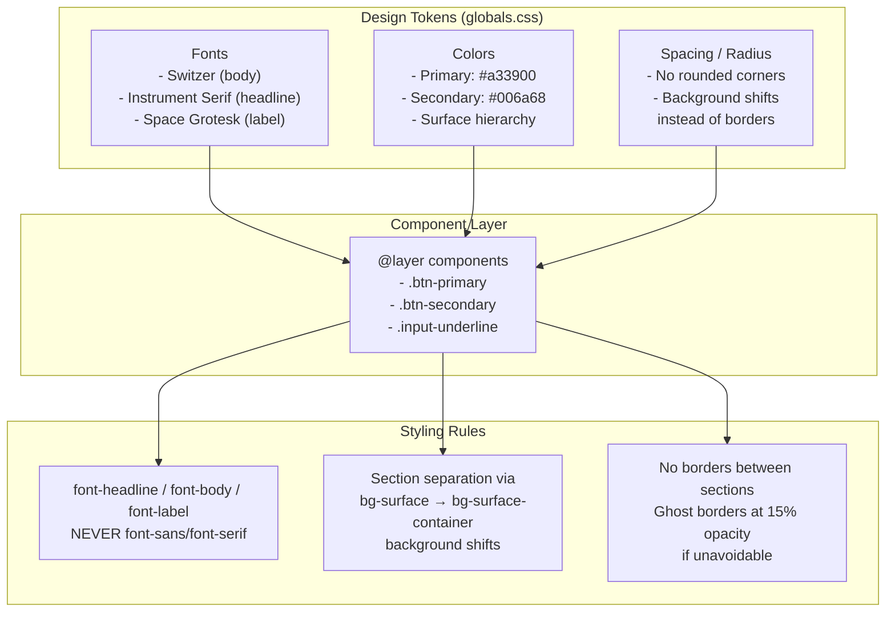
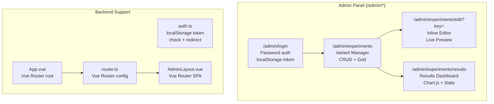
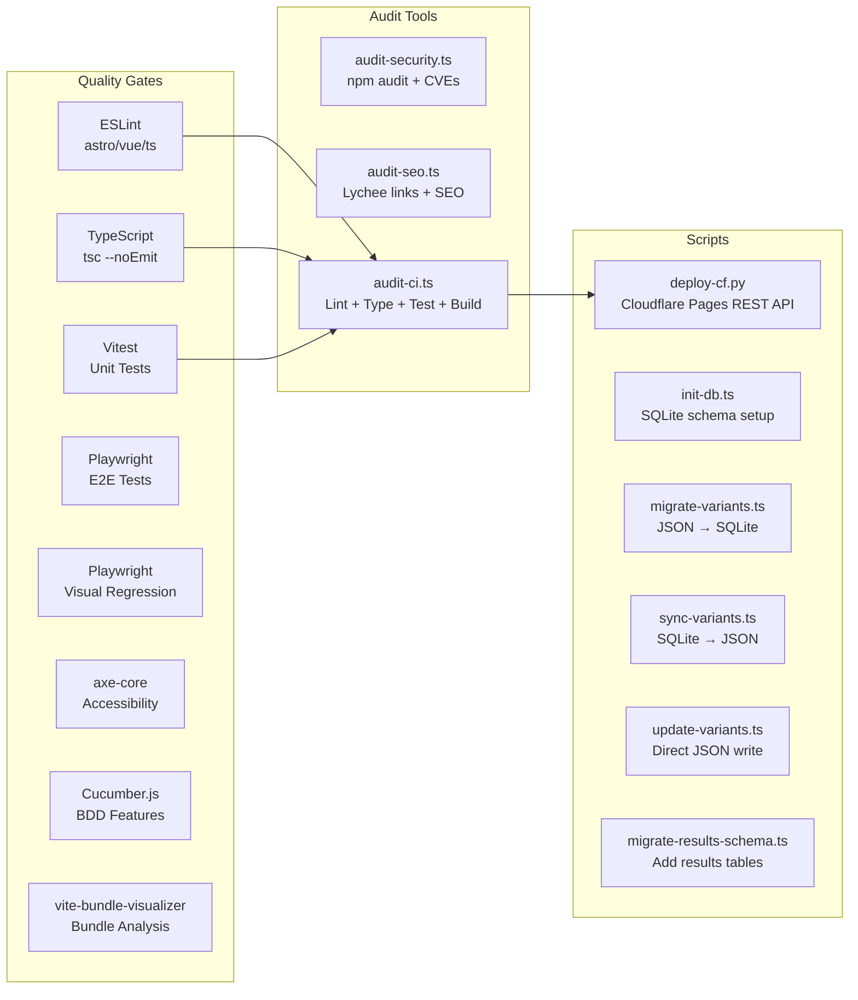
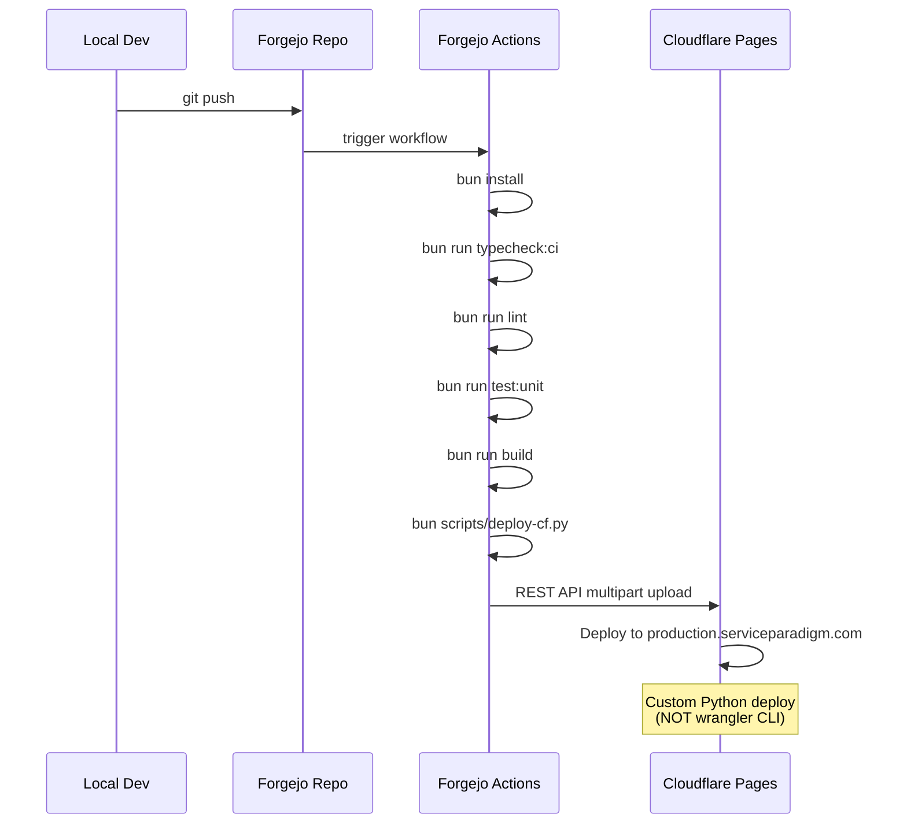
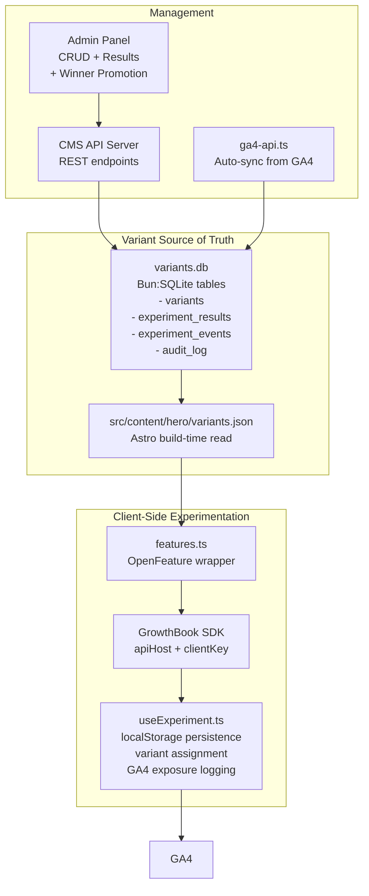
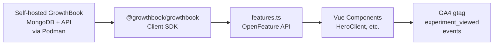
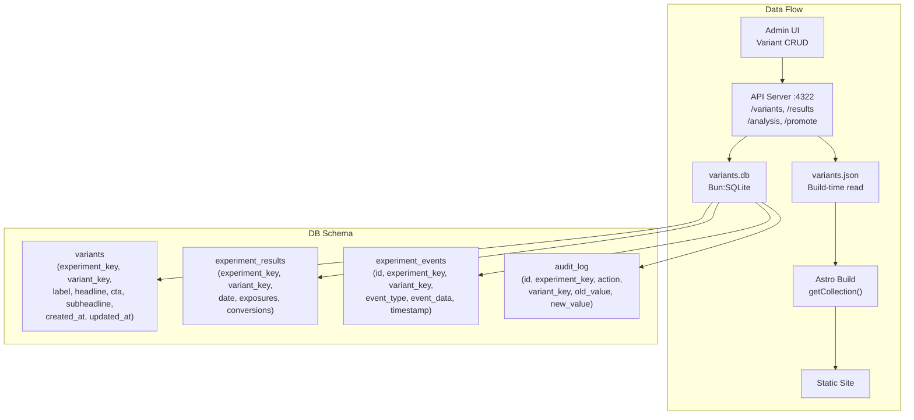

# serviceparadigm.com — Full Site Analysis

**Generated:** 2026-06-11
**Stack:** Astro 6 + Vue 3 + Tailwind v4 + Bun + Cloudflare Pages
**Repo:** `~/lab/serviceparadigm.com/`

---

## Architecture Overview

---

## Public Site Features (Pages)

**Page Inventory:**

| Page | Route | Type | Interactive Elements |
|------|-------|------|-------------------|
| Home | `/` | Astro + Vue SFC | Hero (Vue), Newsletter (Vue) |
| Services | `/services` | Astro static | None |
| Elements | `/elements` | Astro static | Newsletter (Vue) |
| Insights | `/insights` | Astro static | Newsletter (Vue) |
| About | `/about` | Astro static | Newsletter (Vue) |
| Contact | `/contact` | Astro + Vue SFC | ContactForm (Vue) |
| Packaged AI | `/landings/packaged-ai` | Astro + Vue SFC | ContactForm (Vue) |
| Element DP | `/landings/element` | Astro + Vue SFC | ContactForm (Vue) |
| Privacy | `/privacy` | Astro | None |
| Terms | `/terms` | Astro | None |
| Accessibility | `/accessibility` | Astro | None |

---

## Design System

---

## APIs

### 1. CMS API Server (`scripts/api-server.ts` — port 4322)

| Endpoint | Method | Description |
|----------|--------|-------------|
| `/variants?experiment=hero` | GET | Fetch experiment variants from SQLite |
| `/variants` | POST | Save/update variants (upsert) |
| `/variants/:key` | DELETE | Delete a variant |
| `/results?experiment=hero&days=30` | GET | Fetch experiment exposure/conversion results |
| `/results` | POST | Record exposures and/or conversions |
| `/analysis?experiment=hero&days=30` | GET | Full statistical analysis with winner detection |
| `/promote` | POST | Promote a winning variant to default |

**Statistical methods:** Wilson score interval, two-proportion z-test, p-value calculation, winner detection at p<0.05 significance.

### 2. Astro API Endpoint (`src/pages/api/cms/save-variants.ts`)

| Endpoint | Method | Description |
|----------|--------|-------------|
| `/api/cms/save-variants` | POST | Save variants to SQLite + sync to JSON |
| `/api/cms/save-variants?experiment=hero` | GET | Fetch variants from SQLite |

### 3. GA4 Analytics API (`src/cms/lib/ga4-api.ts`)

| Function | Description |
|----------|-------------|
| `fetchConversions()` | Pull conversion events from GA4 via Google Analytics Data API |
| `fetchExposures()` | Pull exposure/impression data from GA4 |
| `syncGA4Data()` | Sync GA4 data with experiment_results table |

**Auth:** Google service account (`secrets/ga4-credentials.json`)

### 4. Content API (`src/cms/lib/content-api.ts`)

| Function | Description |
|----------|-------------|
| `getVariants()` | Fetch variants (dev: direct JSON fetch, prod: import fallback) |
| `saveVariants()` | POST to `/api/cms/save-variants` |
| `createVariant()` | Create + save new variant |
| `updateVariant()` | Partial update existing variant |
| `deleteVariant()` | Remove variant |

### 5. GrowthBook Feature Flag API (`src/lib/features.ts`)

| Function | Description |
|----------|-------------|
| `getStringValue()` | Read string flag (OpenFeature-compatible) |
| `getBooleanValue()` | Read boolean flag |
| `getNumberValue()` | Read numeric flag |
| `getObjectValue()` | Read JSON object flag |
| `isOn()` / `isOff()` | Shorthand boolean tests |

---

## Admin Tools

| Tool | Location | What it does |
|------|----------|-------------|
| **Variant Manager** | `/admin/experiments` | CRUD grid for hero experiment variants. Create, edit, preview, delete variants. Calls `localhost:4322` API. |
| **Inline Editor** | `/admin/experiments/[key]` | Edit variant copy with live preview panel, character counts, save to SQLite. |
| **Results Dashboard** | `/admin/experiments/results` | Chart.js-powered dashboard: conversion rates, exposure/conversion funnel, variant comparison, statistical significance (p-values), confidence intervals, winner detection + promote button. |
| **Login** | `/admin/login` | Simple password auth via `localStorage`. Token: `paradigm2026` (hardcoded for now). |
| **CMS SPA** | `src/cms/` | Vue Router SPA with AdminLayout, routes for /experiments, /experiments/:key, /content |

---

## Dev Tools

### Quality & CI Toolchain

### Available Scripts (`package.json`)

| Category | Scripts |
|----------|---------|
| **Dev** | `bun run dev` (local :4321), `bun run preview` |
| **Build** | `bun run build` → `dist/` directory |
| **Lint** | `bun run lint`, `lint:fix` |
| **TypeCheck** | `bun run typecheck`, `typecheck:ci` |
| **Tests** | `test` (vitest), `test:e2e`, `test:a11y`, `test:visual`, `test:p0`, `test:bdd`, `test:all` |
| **Audits** | `audit:a11y`, `audit:security`, `audit:seo`, `audit:links`, `audit:bundle`, `audit:ci` |
| **CI** | `ci:full` (typecheck + lint + test:unit + build + audit:ci) |
| **CMS** | `bun run scripts/api-server.ts` (standalone CMS API on :4322) |

### Key Dependencies

| Package | Role |
|---------|------|
| `astro@^6.2.1` | Static site generator |
| `vue@^3.5.33` | Client-side interactivity |
| `tailwindcss@^4.3.0` | CSS framework |
| `@tailwindcss/postcss@^4.3.0` | PostCSS plugin for v4 |
| `@growthbook/growthbook@^1.6.5` | Feature flags / A/B testing |
| `@openfeature/web-sdk@^1.8.0` | OpenFeature standard interface |
| `googleapis@^171.4.0` | GA4 Data API client |
| `lucide-vue-next@^1.0.0` | Icon library |
| `sharp@^0.34.5` | Image optimization |
| `@fontsource/instrument-serif` | Self-hosted serif font |
| `@fontsource/space-grotesk` | Self-hosted label font |
| **Dev:** | Playwright, Vitest, ESLint, Cucumber.js, Lighthouse, axe-core, lychee |

### Deployment

**Deploy script:** `scripts/deploy-cf.py` — custom Python that:
1. Builds with `bun run build`
2. Generates SHA256 manifest of all files
3. POSTs multipart form data to Cloudflare Pages API
4. Handles CORS, errors, commit hash tracking

---

## Management Tools

### A/B Experiment System

| Component | What it manages |
|-----------|----------------|
| **Variants** | SQLite DB + JSON file. Variant copy: label, headline, headline_highlight, cta_text, subheadline |
| **Experiments** | Currently scoped to `hero` experiment. `useExperiment.ts` handles random assignment + localStorage persistence |
| **Results** | Daily exposure/conversion aggregates + individual event log. Manual entry + GA4 sync |
| **Analysis** | Wilson score CIs, z-test p-values, winner detection at p<0.05 |
| **Promotion** | Promote winning variant to default via admin UI |
| **Audit Log** | Full history: CREATE, UPDATE, DELETE, PROMOTE actions with before/after JSON snapshots |

### GrowthBook Integration

**Deployment status:** Self-hosted GrowthBook instance deployed in Docker, accessible via Caddy reverse proxy. Client SDK wired in. Currently transitioning from the custom `useExperiment.ts` localStorage system to full GrowthBook feature flags.

### GA4 Analytics Sync

- **Service Account:** Google service account auth
- **Property ID:** Configurable via `GA4_PROPERTY_ID`
- **Metrics:** Exposures (page views, sessions), Conversions (form submissions, newsletter signups)
- **Sync Frequency:** Manual via CLI: `bun run src/cms/lib/ga4-api.ts --experiment=hero --days=7`
- **Diagnostics:** `ga4-diagnose.ts` tests service account access, real-time data, report data existence

---

## CMS Architecture Detail

---

## Deployment & Infrastructure

| Aspect | Details |
|--------|---------|
| **Hosting** | Cloudflare Pages (global edge) |
| **Domain** | `serviceparadigm.com` |
| **Deploy method** | Python REST API (`deploy-cf.py`) — multipart/form-data to Cloudflare API |
| **Account** | Cloudflare account `9d95bf7c9bdb30749459cf45cf671b7c` |
| **Project** | `serviceparadigm-com` |
| **Build output** | `dist/` directory |
| **Branch** | `production` |
| **Cache control** | `public/_headers`: fonts immutable 1yr, JS/CSS 1yr, HTML 0s |

### Local Dev Infrastructure

| Service | URL | Purpose |
|---------|-----|---------|
| Astro Dev Server | `http://localhost:4321` | Main dev server |
| CMS API Server | `http://localhost:4322` | Variant CRUD + results API |
| GrowthBook | Via Caddy reverse proxy | Feature flags & experiments |
| GA4 API | External | Analytics data pull |

---

## Security & Auth

| Layer | Mechanism | Notes |
|-------|-----------|-------|
| **Admin login** | localStorage token (`paradigm2026`) | Basic — hardcoded password. Needs proper auth. |
| **Admin auth.ts** | Password hash comparison + redirect | Simple client-side guard |
| **API auth** | None on CMS API server | Runs on localhost only. No external exposure |
| **Credentials** | `.env` + `secrets/` directory | GA4 service account JSON, GrowthBook keys |
| **Secrets guard** | `.gitignore` ignores `secrets/`, `.env` | Defense-in-depth, readFile blocks `.env` |
| **HITL protocol** | SOUL.md section 9-11 | Account creation, credential sharing, email — all require Hal approval |

---

## Summary Statistics

| Metric | Value |
|--------|-------|
| **Total pages** | 11 public + 4 admin |
| **API endpoints** | 8 (CMS API) + 2 (Astro API) + GA4 (3 functions) |
| **Admin tools** | 4 pages (login, variants, editor, results) + Vue Router SPA |
| **Dev scripts** | 11 scripts + 18 npm scripts |
| **DB tables** | 4 (variants, experiment_results, experiment_events, audit_log) |
| **Feature flags** | GrowthBook SDK + OpenFeature wrapper |
| **Analytics** | GA4 via Google service account |
| **Test suites** | Unit (Vitest), E2E (Playwright), Visual Regression, A11Y (axe), BDD (Cucumber) |
| **Audit tools** | Security (npm audit, CVEs), SEO (lychee), CI aggregator |
| **Quality gates** | Lint + TypeCheck + Unit Tests + Build + Audits |
| **Deploy method** | Custom Python → Cloudflare REST API |
